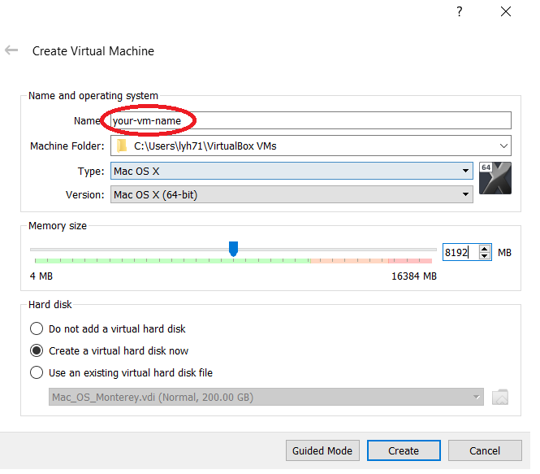
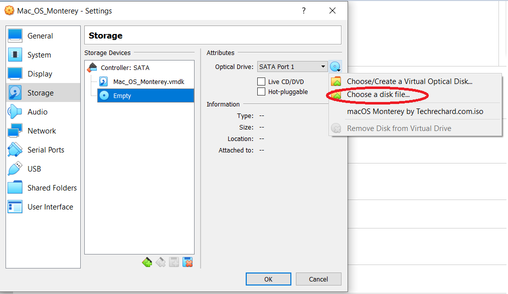

# mac_in_win10
Setup Mac OS within Windows 10 using VirtualBox

## Mac OS version involved:
- Big Sur
- Monterey

## Steps:
- Download and install **VirtualBox** as well as the corresponding **VirtualBox Extension Pack** for Windows 10 via: https://www.virtualbox.org/wiki/Downloads

- Obtain the VirtualBOx ISO images for the macOS version we plan to install:
    - Generated from another Mac machine
    - Search Google 

- Luanch the VirtualBox and install the macOS ISO images as below:
    - 
    
    - 
    
    Make sure to note the **Name** you input, which will be needed later on. We recommend to allocate at least half of the total Memory size for the VM.

    - 

    Note we recommend to set at least 200GB hard disk size for the virtual macOS.

    - The initial virtual machine (by the **Name** you input above) should be setup by now, and we can continue with more **Settings**:
        - 
        
        - 

        For **System**:
            - Remove "Floppy" as we don't need it
            -  More importantly, we shall allocate **no more than** half of the "Processor" (CPU) we have in total, to maintain balanced performance between the host Windows 10 and the virtual Mac.

        - 
        
        Note to set the Display memory to **maximum**

        -  

        Note to select the corresponding ISO image we have obtained.

        -  

- Click **OK** once above is all done, and **EXIT** from the VirtualBox completely. This is **important** before we proceed with the below steps.

- Obtain the VirtualBox code for the macOS version we plan to install (search Google):
    - VirtualBox_Code_BigSur.txt
    - VirtualBox_Code_Monterey.txt

- Execute the above VirtualBox code via the **command prompt** of Windows 10 (as Administrator)

- Obtain the VirtualBox code for config the screen resolution after the macOS VM setup:
    - VirtualBox_Code_macOS_Screen_Resolution.txt

